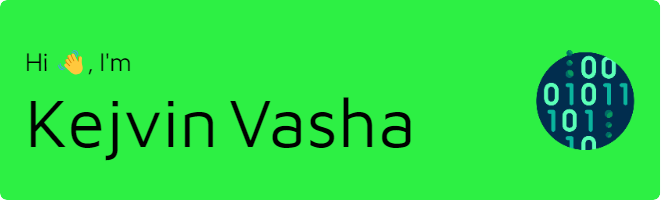

- 👋 Hi, I’m @kejvinvasha
- 🏫 I'm a second-year computer science student at York University.
- 👀 I’m interested in software development, web technologies such as React, HTML/CSS, JavaScript, and security.
- 🌱 I’m currently learning more about web development and different programming languages.
- 😄 Pronouns: He/him

### Skills 

 
      

### Socials

 <a href="https://www.github.com/kejvinvasha" target="_blank" rel="noreferrer"> <picture> <source media="(prefers-color-scheme: dark)" srcset="https://raw.githubusercontent.com/danielcranney/readme-generator/main/public/icons/socials/github-dark.svg" /> <source media="(prefers-color-scheme: light)" srcset="https://raw.githubusercontent.com/danielcranney/readme-generator/main/public/icons/socials/github.svg" />  </picture> </a> <a href="https://www.linkedin.com/in/kejvin-vasha/" target="_blank" rel="noreferrer"> <picture> <source media="(prefers-color-scheme: dark)" srcset="https://raw.githubusercontent.com/danielcranney/readme-generator/main/public/icons/socials/linkedin-dark.svg" /> <source media="(prefers-color-scheme: light)" srcset="https://raw.githubusercontent.com/danielcranney/readme-generator/main/public/icons/socials/linkedin.svg" />  </picture> </a>
          
<!---
kejvinvasha/kejvinvasha is a ✨ special ✨ repository because its `README.md` (this file) appears on your GitHub profile.
You can click the Preview link to take a look at your changes.
--->
